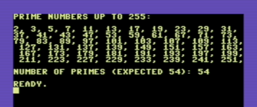
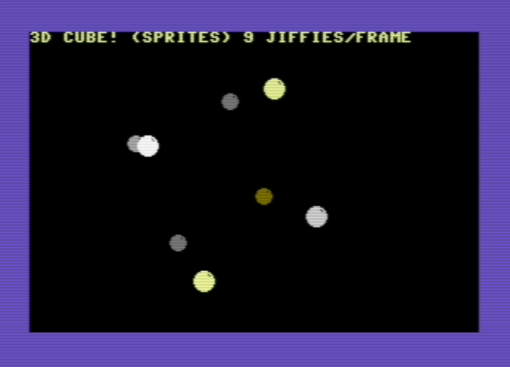

Prog8 - Structured Programming Language for 8-bit 6502/6510 microprocessors
===========================================================================

*Written by Irmen de Jong (irmen@razorvine.net)*

*Software license: GNU GPL 3.0, see file LICENSE*

This is a structured programming language for the 8-bit 6502/6510 microprocessor from the late 1970's and 1980's
as used in many home computers from that era. It is a medium to low level programming language,
which aims to provide many conveniences over raw assembly code (even when using a macro assembler):

- reduction of source code length
- modularity, symbol scoping, subroutines
- various data types other than just bytes (16-bit words, floats, strings)
- automatic variable allocations, automatic string and array variables and string sharing
- subroutines with a input- and output parameter signature
- constant folding in expressions
- conditional branches
- 'when' statement to provide a concise jump table alternative to if/elseif chains
- structs to group together sets of variables and manipulate them at once
- floating point operations  (requires the C64 Basic ROM routines for this)
- abstracting away low level aspects such as ZeroPage handling, program startup, explicit memory addresses
- various code optimizations (code structure, logical and numerical expressions, unused code removal...)
- inline assembly allows you to have full control when every cycle or byte matters
- many built-in functions such as ``sin``, ``cos``, ``rnd``, ``abs``, ``min``, ``max``, ``sqrt``, ``msb``, ``rol``, ``ror``, ``swap``, ``memset``, ``memcopy``, ``sort`` and ``reverse``

Rapid edit-compile-run-debug cycle:

- use modern PC to work on
- quick compilation times (seconds)
- option to automatically run the program in the Vice emulator
- breakpoints, that let the Vice emulator drop into the monitor if execution hits them
- source code labels automatically loaded in Vice emulator so it can show them in disassembly
- virtual machine that can execute compiled code directy on the host system,
  without having to actually convert it to assembly to run on a real 6502

It is mainly targeted at the Commodore-64 machine at this time.
Contributions to add support for other 8-bit (or other?!) machines are welcome.

Documentation/manual
--------------------
This describes the language, but also how to build and run the compiler. See https://prog8.readthedocs.io/

Required tools
--------------

[64tass](https://sourceforge.net/projects/tass64/) - cross assembler. Install this on your shell path.
A recent .exe version of this tool for Windows can be obtained from my [clone](https://github.com/irmen/64tass/releases) of this project.
For other platforms it is very easy to compile it yourself (make ; make install).

A **Java runtime (jre or jdk), version 8 or newer**  is required to run a prepackaged version of the compiler.
If you want to build it from source, you'll need a Java SDK + Kotlin 1.3.x SDK (or for instance,
IntelliJ IDEA with the Kotlin plugin).

It's handy to have a C-64 emulator or a real C-64 to run the programs on. The compiler assumes the presence
of the [Vice emulator](http://vice-emu.sourceforge.net/)

Example code
------------

This code calculates prime numbers using the Sieve of Eratosthenes algorithm::

    %import c64utils
    %zeropage basicsafe

    main {

        ubyte[256] sieve
        ubyte candidate_prime = 2

        sub start() {
            memset(sieve, 256, false)

            c64scr.print("prime numbers up to 255:\n\n")
            ubyte amount=0
            while true {
                ubyte prime = find_next_prime()
                if prime==0
                    break
                c64scr.print_ub(prime)
                c64scr.print(", ")
                amount++
            }
            c64.CHROUT('\n')
            c64scr.print("number of primes (expected 54): ")
            c64scr.print_ub(amount)
            c64.CHROUT('\n')
        }

        sub find_next_prime() -> ubyte {

            while sieve[candidate_prime] {
                candidate_prime++
                if candidate_prime==0
                    return 0
            }

            sieve[candidate_prime] = true
            uword multiple = candidate_prime
            while multiple < len(sieve) {
                sieve[lsb(multiple)] = true
                multiple += candidate_prime
            }
            return candidate_prime
        }
    }

when compiled an ran on a C-64 you'll get:

One of the included examples (wizzine.p8) animates a bunch of sprite balloons and looks like this:

Another example (cube3d-sprites.p8) draws the vertices of a rotating 3d cube:

If you want to play a video game, a fully working Tetris clone is included in the examples:

